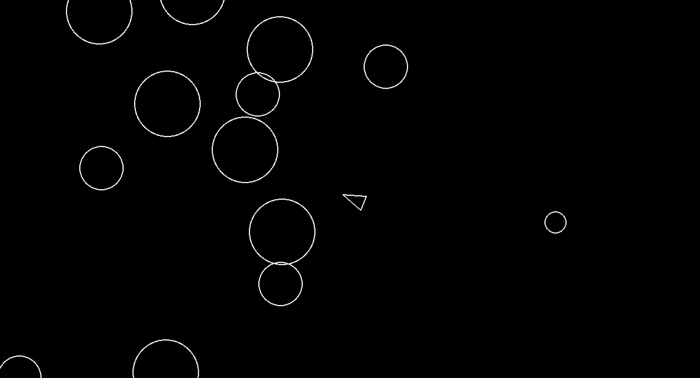

# Asteroids Game

A classic Asteroids-style arcade game built with Python and Pygame as part of the Boot.dev curriculum.

## Features

* Smooth player movement and rotation
* Shooting mechanics
* Asteroid splitting
* Collision detection
* Object-oriented design

## Gameplay




## How to Run

```bash
python main.py
```

## Requirements

* Python 3
* pygame

Install dependencies:

```bash
pip install pygame
```

## Controls

* Move: Arrow keys / WASD
* Shoot: Spacebar

## Design Overview

This project uses object-oriented programming to model game entities:

- `Player` handles movement, rotation, and shooting
- `Asteroid` handles splitting behavior
- `CircleShape` base class manages collision logic

The game loop is responsible for:
- Updating entity state
- Handling collisions
- Rendering frames at consistent FPS
